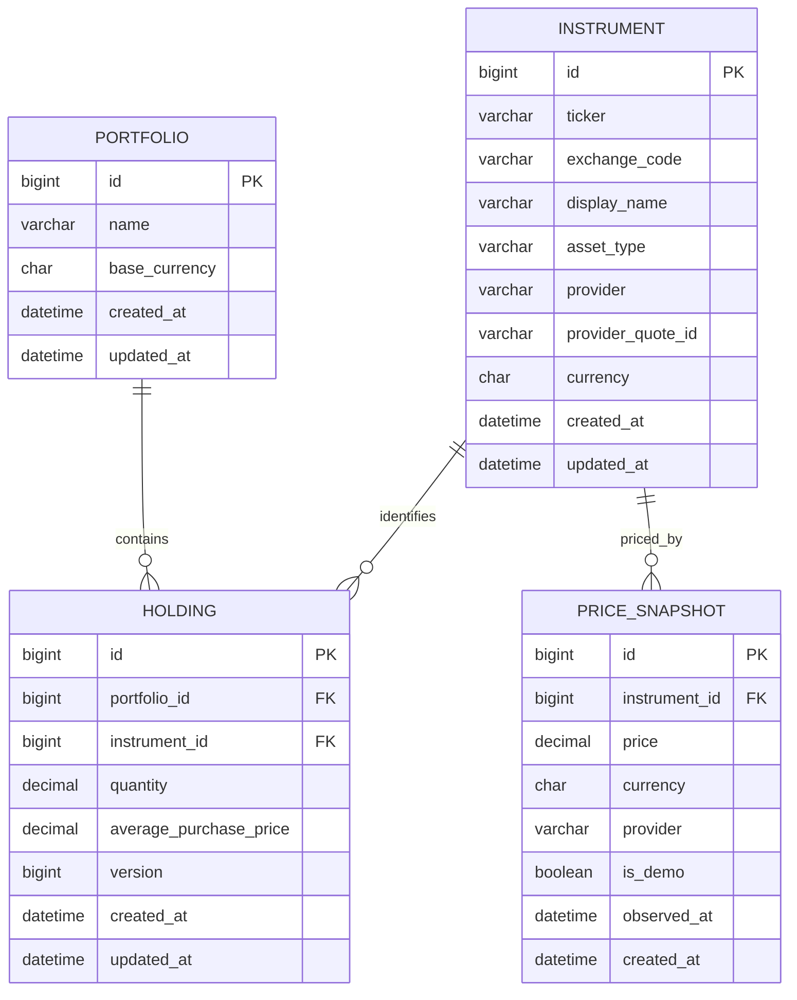

# HoldHive 数据库设计

## 1. 设计目标

本设计优先支持两天编码周期内的多资产 MVP，同时保留向多组合、历史价格、交易流水和多币种扩展的路径。

设计原则：

- 使用 MySQL 8.4 LTS 和 InnoDB，并确保项目环境的小版本能够执行全部 Flyway 迁移。
- 金额和数量使用定点数，不使用浮点数。
- 持仓事实与市场价格分离，外部价格失败不能破坏持仓数据。
- MVP 不引入用户、券商账户、交易、税务和公司行动等复杂模型。
- 通过外键、唯一约束和检查约束保护数据，而不是只依赖前端校验。
- 数据库迁移脚本纳入 Git，并按版本顺序执行。

## 2. 分阶段模型

### MVP 必须实现

- `portfolio`：组合基本信息。当前虽然只有一个组合，仍保留组合边界，避免持仓表以后整体重构。
- `instrument`：可估值资产的稳定身份，不把 ticker 文本重复存入每条持仓。
- `holding`：某个组合当前持有某个证券的数量和平均成本。
- `price_snapshot`：市场价格缓存和数据来源状态。

### 后续扩展

- `portfolio_transaction`：买入、卖出、股息、费用、存取款等不可变流水。
- `portfolio_valuation`：按日保存组合价值，用于历史表现图。
- `app_user`、`portfolio_member`：认证和多用户授权。
- `account`：券商、现金或托管账户。
- `exchange_rate`：多币种换算。

MVP 不应提前创建所有扩展表。扩展模型用于锁定演进方向，防止当前字段设计堵死后续能力。

## 3. 实体关系



## 4. 表结构

### 4.1 `portfolio`

| 字段 | 建议类型 | 约束 | 说明 |
| --- | --- | --- | --- |
| `id` | `BIGINT` | PK，自动生成 | 组合 ID |
| `name` | `VARCHAR(100)` | NOT NULL | 组合名称 |
| `base_currency` | `CHAR(3)` | NOT NULL，默认 `USD` | ISO 4217 基准币种 |
| `created_at` | `DATETIME(6)` | NOT NULL | UTC 创建时间 |
| `updated_at` | `DATETIME(6)` | NOT NULL | UTC 最后更新时间 |

MVP 启动时创建一个默认组合，例如 `My Portfolio`，但业务代码不应把 ID `1` 散落在各处。默认组合 ID应由配置或查询获得。

### 4.2 `instrument`

| 字段 | 建议类型 | 约束 | 说明 |
| --- | --- | --- | --- |
| `id` | `BIGINT` | PK，自动生成 | 资产 ID |
| `ticker` | `VARCHAR(32)` | NOT NULL | 标准化为大写，例如 `AAPL`、`VOO`、`BTC`、`USD` |
| `exchange_code` | `VARCHAR(16)` | NOT NULL，默认 `UNKNOWN` | 交易所或分类代码；现金使用 `CASH` |
| `display_name` | `VARCHAR(160)` | NULL | 展示名称 |
| `asset_type` | `VARCHAR(24)` | NOT NULL，默认 `STOCK` | MVP 允许 `STOCK`、`ETF`、`MUTUAL_FUND`、`CRYPTO`、`CASH`、`BANK_DEPOSIT` |
| `provider` | `VARCHAR(32)` | NULL | 行情来源，例如 `EASTMONEY`、`DEMO`、`FIXED` |
| `provider_quote_id` | `VARCHAR(64)` | NULL | 外部行情 ID，例如 `105.AAPL`；现金为 `NULL` |
| `currency` | `CHAR(3)` | NOT NULL，默认 `USD` | 报价币种 |
| `created_at` | `DATETIME(6)` | NOT NULL | UTC 创建时间 |
| `updated_at` | `DATETIME(6)` | NOT NULL | UTC 最后更新时间 |

唯一约束：`UNIQUE (asset_type, ticker, exchange_code)`。这样 `BTC` 作为加密资产不会与同名股票或其他资产类别冲突。

资产类型规则：

- `STOCK` 和 `ETF`：通常需要 `provider_quote_id`，可以来自 `/api/v1/market/search`；ETF 估值像股票，底层持仓只进入穿透分析。
- `MUTUAL_FUND`：保存基金代码或自定义代码，MVP 可使用演示/缓存净值；持仓披露数据进入独立的 fund lookthrough 数据，不写回主持仓。
- `CRYPTO`：MVP 可以使用 `provider = DEMO` 和演示价格；接入实时接口后再保存真实 provider quote id。
- `CASH`：`ticker` 使用币种代码，例如 `USD`；`exchange_code = CASH`；`provider = FIXED`；不需要 `price_snapshot`。
- `BANK_DEPOSIT`：`ticker` 使用可读代码，例如 `HSBC_USD`；`exchange_code = BANK`；`provider = FIXED`；MVP 按本金固定估值，不自动计提利息。

### 4.3 `holding`

| 字段 | 建议类型 | 约束 | 说明 |
| --- | --- | --- | --- |
| `id` | `BIGINT` | PK，自动生成 | 持仓 ID |
| `portfolio_id` | `BIGINT` | NOT NULL，FK | 所属组合 |
| `instrument_id` | `BIGINT` | NOT NULL，FK | 对应证券 |
| `quantity` | `DECIMAL(24,8)` | NOT NULL，`> 0` | 持仓数量，支持小数份额 |
| `average_purchase_price` | `DECIMAL(24,8)` | NOT NULL，`>= 0` | 每单位平均买入价 |
| `version` | `BIGINT` | NOT NULL，默认 `0` | 后续更新时用于乐观锁 |
| `created_at` | `DATETIME(6)` | NOT NULL | UTC 创建时间 |
| `updated_at` | `DATETIME(6)` | NOT NULL | UTC 最后更新时间 |

唯一约束：`UNIQUE (portfolio_id, instrument_id)`。MVP 中同一组合不得重复创建同一证券；重复请求返回 `409 HOLDING_ALREADY_EXISTS`。未来若需要分批成本，应引入交易或批次表，而不是复制持仓行。

外键删除策略：删除组合时可以级联删除其持仓；删除已被持仓引用的证券应被拒绝。MVP 只删除持仓，不物理删除证券主数据。

### 4.4 `price_snapshot`

| 字段 | 建议类型 | 约束 | 说明 |
| --- | --- | --- | --- |
| `id` | `BIGINT` | PK，自动生成 | 价格记录 ID |
| `instrument_id` | `BIGINT` | NOT NULL，FK | 对应证券 |
| `price` | `DECIMAL(24,8)` | NOT NULL，`>= 0` | 市场价格 |
| `currency` | `CHAR(3)` | NOT NULL | 报价币种 |
| `provider` | `VARCHAR(64)` | NOT NULL | 数据提供方，例如 `SAMPLE_API` |
| `is_demo` | `BOOLEAN` | NOT NULL，默认 `FALSE` | 是否为演示价格 |
| `observed_at` | `DATETIME(6)` | NOT NULL | 价格对应的 UTC 市场时间 |
| `created_at` | `DATETIME(6)` | NOT NULL | UTC 系统写入时间 |

唯一约束：`UNIQUE (instrument_id, provider, observed_at)`。

MVP 查询只取每个资产最新的一条有效价格。市场服务失败时，可以读取未过期缓存；若使用演示数据，必须设置 `is_demo = true` 并通过 API 返回该状态。现金不写入 `price_snapshot`，由后端按固定价格规则直接估值。

## 5. 参考 DDL

以下 DDL 面向 MySQL 8.4。所有连接必须使用 UTC，会话初始化执行 `SET time_zone = '+00:00'`；应用层仍以 ISO 8601 UTC 对外传输时间。

```sql
CREATE TABLE portfolio (
    id BIGINT UNSIGNED NOT NULL AUTO_INCREMENT,
    name VARCHAR(100) NOT NULL,
    base_currency CHAR(3) NOT NULL DEFAULT 'USD',
    created_at DATETIME(6) NOT NULL,
    updated_at DATETIME(6) NOT NULL,
    PRIMARY KEY (id)
) ENGINE=InnoDB DEFAULT CHARSET=utf8mb4 COLLATE=utf8mb4_0900_ai_ci;

CREATE TABLE instrument (
    id BIGINT UNSIGNED NOT NULL AUTO_INCREMENT,
    ticker VARCHAR(32) NOT NULL,
    exchange_code VARCHAR(16) NOT NULL DEFAULT 'UNKNOWN',
    display_name VARCHAR(160),
    asset_type VARCHAR(24) NOT NULL DEFAULT 'STOCK',
    provider VARCHAR(32),
    provider_quote_id VARCHAR(64),
    currency CHAR(3) NOT NULL DEFAULT 'USD',
    created_at DATETIME(6) NOT NULL,
    updated_at DATETIME(6) NOT NULL,
    PRIMARY KEY (id),
    CONSTRAINT ck_instrument_asset_type
        CHECK (asset_type IN ('STOCK', 'ETF', 'MUTUAL_FUND', 'CRYPTO', 'CASH', 'BANK_DEPOSIT')),
    CONSTRAINT uq_instrument_symbol UNIQUE (asset_type, ticker, exchange_code)
) ENGINE=InnoDB DEFAULT CHARSET=utf8mb4 COLLATE=utf8mb4_0900_ai_ci;

CREATE TABLE holding (
    id BIGINT UNSIGNED NOT NULL AUTO_INCREMENT,
    portfolio_id BIGINT UNSIGNED NOT NULL,
    instrument_id BIGINT UNSIGNED NOT NULL,
    quantity DECIMAL(24,8) NOT NULL,
    average_purchase_price DECIMAL(24,8) NOT NULL,
    version BIGINT UNSIGNED NOT NULL DEFAULT 0,
    created_at DATETIME(6) NOT NULL,
    updated_at DATETIME(6) NOT NULL,
    PRIMARY KEY (id),
    CONSTRAINT ck_holding_quantity CHECK (quantity > 0),
    CONSTRAINT ck_holding_average_price CHECK (average_purchase_price >= 0),
    CONSTRAINT uq_holding_instrument UNIQUE (portfolio_id, instrument_id),
    CONSTRAINT fk_holding_portfolio FOREIGN KEY (portfolio_id)
        REFERENCES portfolio(id) ON DELETE CASCADE,
    CONSTRAINT fk_holding_instrument FOREIGN KEY (instrument_id)
        REFERENCES instrument(id)
) ENGINE=InnoDB DEFAULT CHARSET=utf8mb4 COLLATE=utf8mb4_0900_ai_ci;

CREATE TABLE price_snapshot (
    id BIGINT UNSIGNED NOT NULL AUTO_INCREMENT,
    instrument_id BIGINT UNSIGNED NOT NULL,
    price DECIMAL(24,8) NOT NULL,
    currency CHAR(3) NOT NULL,
    provider VARCHAR(64) NOT NULL,
    is_demo BOOLEAN NOT NULL DEFAULT FALSE,
    observed_at DATETIME(6) NOT NULL,
    created_at DATETIME(6) NOT NULL,
    PRIMARY KEY (id),
    CONSTRAINT ck_price_non_negative CHECK (price >= 0),
    CONSTRAINT uq_price_observation
        UNIQUE (instrument_id, provider, observed_at),
    CONSTRAINT fk_price_instrument FOREIGN KEY (instrument_id)
        REFERENCES instrument(id)
) ENGINE=InnoDB DEFAULT CHARSET=utf8mb4 COLLATE=utf8mb4_0900_ai_ci;
```

## 6. 索引设计

```sql
CREATE INDEX idx_holding_portfolio ON holding(portfolio_id);
CREATE INDEX idx_price_latest
    ON price_snapshot(instrument_id, observed_at DESC);
```

MVP 数据量很小，不应创建大量推测性索引。新增索引前应通过查询计划或可复现的性能问题证明必要性。

## 7. 一致性与事务

- 创建持仓时，在同一事务中查找或创建 `instrument`，随后创建 `holding`。
- 依靠唯一约束处理并发重复，不使用“先查后插”作为唯一保护。
- 删除持仓只删除 `holding`；不删除 `instrument` 和历史价格。
- 从外部获取价格不应与持仓写事务绑定，避免网络超时长时间占用数据库事务。
- 时间统一以 UTC 保存，API 使用 ISO 8601，例如 `2026-07-24T08:30:00Z`。
- MySQL 服务、JDBC 连接和应用时区全部显式设为 UTC；不得依赖开发机本地时区。
- 金额计算使用 `BigDecimal`、`Decimal` 或等价定点类型，并在展示层统一舍入。

## 8. 扩展到交易账本

当产品需要买卖历史、已实现盈亏、股息或历史收益时，增加不可变流水表：

```text
portfolio_transaction
- id
- portfolio_id
- instrument_id
- transaction_type: BUY | SELL | DIVIDEND | FEE | DEPOSIT | WITHDRAWAL
- trade_date
- quantity
- unit_price
- fee_amount
- currency
- external_reference
- created_at
```

届时 `holding` 可继续作为由交易聚合得到的读模型，以提高查询速度；交易表成为事实来源。迁移步骤应为：创建交易表、为现有持仓生成期初交易、双写校验、切换计算来源，而不是直接删除现有持仓数据。

## 9. 数据库验收清单

- [ ] 所有表通过版本化迁移创建，不依赖手工建表。
- [ ] 数量、价格和唯一性约束同时在服务层和数据库层生效。
- [ ] 同一组合不能重复创建相同证券持仓。
- [ ] 删除持仓不会删除证券或价格历史。
- [ ] 市场价格失败不会修改或丢失持仓。
- [ ] 测试覆盖空组合、重复持仓、非法数值、外键失败和并发重复。
- [ ] 数据库中不保存浮点金额、密钥、券商凭据或真实个人资产信息。
